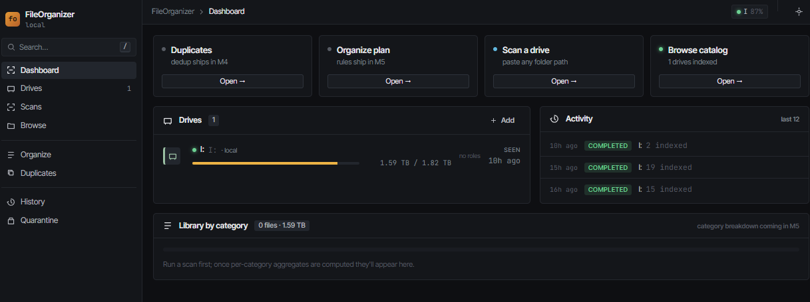

# FileOrganizer

A local-first tool for cleaning up personal file storage across multiple
drives — find byte-identical duplicates, organize photos and documents by
year, route categories to specific drives (including a NAS), and recover
disk space before a machine migration.

Runs entirely on your own machine. Nothing leaves your network, nothing is
uploaded anywhere. The catalog is a local SQLite file you own and can move.



## What it does

- **Scans** drives and indexes images, video, audio, documents, spreadsheets,
  presentations, archives, ebooks, and code into a local catalog. System
  files (`Windows`, `Program Files`, `node_modules`, `.git`, etc.) are
  skipped automatically.
- **Detects byte-identical duplicates** across every indexed drive at once,
  ranks them, and proposes a keeper based on drive role, path depth,
  filesystem mtime, and other tiebreakers.
- **Quarantines** non-keepers into a per-drive `_FileOrganizer_quarantine/`
  folder. Nothing is hard-deleted — files are recoverable until you
  explicitly purge.
- **Organizes** photos and documents by date and category, with
  cross-drive moves gated by your approval, dry-run preview, and
  per-batch undo.
- Scans are **resumable** and **throttleable** — run at full speed overnight,
  idle profile during the workday.

## Status

| Milestone | What's in it | State |
| --- | --- | --- |
| M0 | Repo setup, monorepo, tooling | ✅ done |
| M1 | Catalog schema, drives, settings, CLI | ✅ done |
| M2 | Scan pipeline (walk, hash, EXIF/video metadata, throttle) | ✅ done |
| M3 | Local web UI (Dashboard / Drives / Scans / Browse) | ✅ done |
| M4 | Duplicates + Quarantine | ✅ done |
| M5 | Rules engine + organize + undo | ✅ done |
| M6 | Drive roles + throttle schedules | 🚧 in progress |
| M7 | Polish, reconciliation, performance pass | ⏳ |

See `docs/superpowers/plans/` for the full plan and `docs/superpowers/specs/`
for the design spec.

## Prerequisites

- **Node 22 or 24 LTS** (24 recommended). Node 18 is too old.
- **Git** to clone.
- **Windows is the primary target.** POSIX (macOS / Linux) works for the
  scanner and most of the catalog, but volume detection and drive-letter
  resolution have less coverage there.
- For video metadata, the engine shells out to MediaInfo CLI. `npm run
  fetch-binaries` downloads it to `packages/engine/bin/`. If that fails (or
  you skip it), video files are still indexed — just without their embedded
  creation date.

## Quick start

```
git clone https://github.com/curtyo18/FileOrganizer.git
cd FileOrganizer
npm install
npm run start
```

The first `npm run start` builds the UI, creates a catalog at the default
location, and boots a local web server bound to `127.0.0.1`. Open the
printed URL in your browser. Go to **Scans**, paste any absolute folder
path, hit Scan. The drive is auto-detected and registered.

Catalog default location:
- Windows: `%APPDATA%\FileOrganizer\catalog.db`
- macOS/Linux: `~/.fileorganizer/catalog.db`

## Is it safe to run?

- **Scanning is read-only.** The engine reads files to compute hashes and
  EXIF metadata. It never modifies or moves a file during a scan.
- **Dedup moves files into a per-drive quarantine folder, not the trash.**
  Each batch creates `<drive>\_FileOrganizer_quarantine\<batch-id>\…`
  preserving the original folder structure. The Quarantine screen lets you
  restore any subset back to the original path. There is no auto-purge.
- **Nothing crosses drives without your explicit approval** (cross-drive
  copies first verify the destination hash, then quarantine the source —
  so a power loss leaves both copies, never zero).

That said, this is alpha-quality software. **Run it against a small test
folder first**, or ensure you have a backup of anything irreplaceable
before turning it loose on a real library.

## CLI (optional)

The web UI uses the same engine, but the CLI is also exposed:

```
npx tsx packages/engine/src/cli/index.ts init --catalog D:\custom\catalog.db
npx tsx packages/engine/src/cli/index.ts scan --path "D:\Pictures"
npx tsx packages/engine/src/cli/index.ts status
```

## How it's built

- **Engine**: Node + TypeScript, `better-sqlite3`, `Hono` HTTP server,
  `node:crypto` for hashing, `node:worker_threads` for parallelism, `exifr`
  for image metadata, MediaInfo subprocess for video.
- **UI**: Preact + Vite, served by the engine on `127.0.0.1`. Dark dense
  pro-tool aesthetic; design tokens in `packages/ui/src/styles.css`.
- **Catalog**: a single SQLite file. Schema in
  `packages/engine/src/catalog/migrations/`. Move it to a different drive
  any time — the pointer is one small JSON file under `%APPDATA%`.

## License

No license set yet. If you want to use, fork, or modify this code, open an
issue first.
